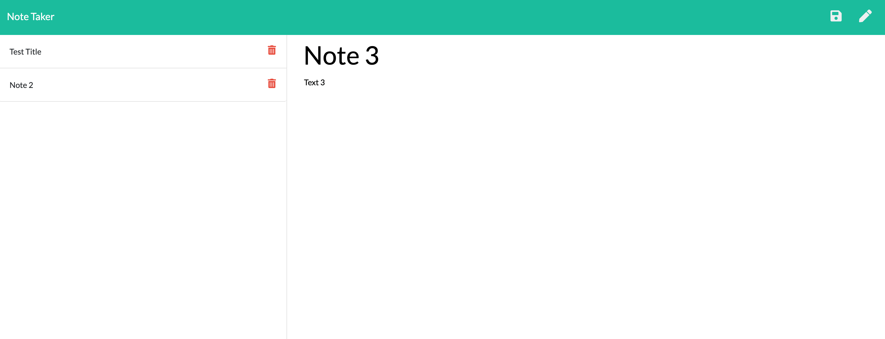

# Assignment 11: Note Taker

## Description

* The following full-stack application allows users to create and save notes; these are in turn saved to the json file "db.json", in which the notes are stored as objects in an array.

* The application also allows users to view previously saved notes when the page is refreshed, as they are stored in the json file "db.json".

* The application allows users to delete previously saved notes; these are in turn deleted from the json file "db.json", in which the notes are stored as objects in an array.

## User Story

AS A user, I want to be able to write and save notes

I WANT to be able to delete notes I've written before

SO THAT I can organize my thoughts and keep track of tasks I need to complete

## Application Screenshot

## Accessories Used
### Languages
* HTML
* CSS
* JavaScript
* [jQuery](https://jquery.com/)
* [Bootstrap CSS Framework](https://getbootstrap.com/)
* [Font Awesome](https://fontawesome.com/)
* JSON
* ES6+
* APIs

### Programs and Applications
* [Node.js](https://nodejs.org/en/)
* Git/Terminal

### Packages
* [Express](https://expressjs.com/)
* fs

### Websites
* [GitHub](https://github.com/)
* [Heroku](https://www.heroku.com/)

## Deployed Links

* Deployed URLs: https://floating-cliffs-26268.herokuapp.com/

* GitHub Repository URL: https://github.com/MG-cpu90/assignment11
